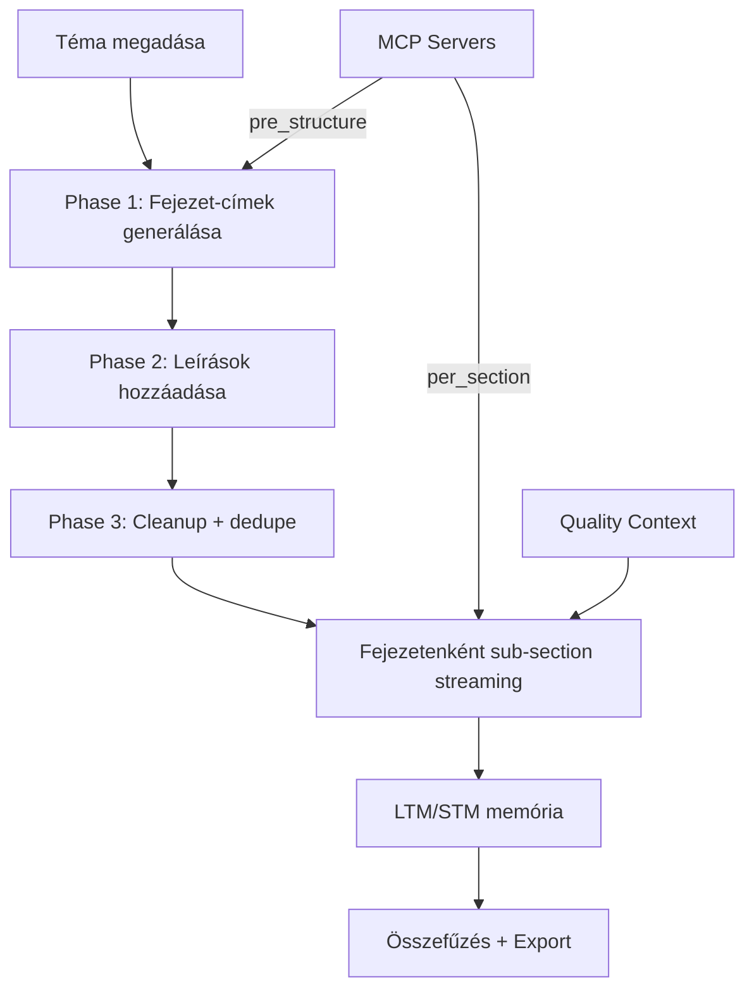
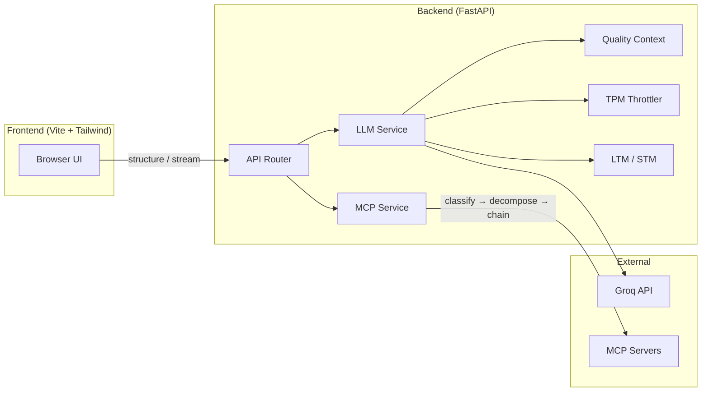

# HunBook – AI Book Generator

Teljes könyvek generálása egyetlen témamegadással. Intelligens struktúra-tervezés, fejezet-szintű streaming, MCP-alapú kutatás, és whitepaper-minőségű szövegkimenet — ingyenesen, lokálisan futtatható.

<p align="center">
  
</p>

---

## Tartalomjegyzék

- [Hogyan működik](#hogyan-működik)
- [Fő funkciók](#fő-funkciók)
- [Architektúra](#architektúra)
- [Helyi futtatás](#helyi-futtatás)
- [Környezeti változók](#környezeti-változók)
- [Használat](#használat)
- [API áttekintés](#api-áttekintés)
- [MCP integráció](#mcp-integráció)
- [Tesztelés](#tesztelés)
- [Hibaelhárítás](#hibaelhárítás)
- [Changelog](#changelog)
- [Licenc](#licenc)

---

## Hogyan működik



**3-fázisú struktúra-generálás:**

| Fázis | LLM utasítás | Eredmény |
|---|---|---|
| Phase 1 | "Adj vissza N fejezet-címet" | JSON tömb (soha nem csonkolódik) |
| Phase 2 | "Minden címhez 1-2 mondatos leírás" | `{title: description}` map |
| Phase 3 | Cleanup, dedupe, limit (kód) | Végleges outline |

**Per-fejezet generálás:**
- Dinamikus sub-section bontás (1–4 szegmens / fejezet)
- Short-Term Memory (STM): seamless folytatás szegmensek között
- Long-Term Memory (LTM): cross-chapter konzisztencia
- Quality Context injection: whitepaper-alapú struktúra sablonok

---

## Fő funkciók

### Generálás
- **3–50 fejezet** — dinamikus slider, bármilyen terjedelmű könyv
- **Sub-section streaming** — fejezetek 1–4 szegmensre bontva, külön generálva
- **LTM/STM memória** — koherencia fejezetek között és azon belül
- **Quality Context** — whitepaper-elemzésből származó struktúra sablonok (HOOK→CONTEXT→EVIDENCE→IMPLICATION)
- **TPM throttling** — automatikus rate-limit kezelés, minőségre optimalizált

### MCP (Model Context Protocol)
- **Multi-call pipeline** — nem 1, hanem 2-3 célzott hívás szerverenként
- **Server classification** — auto-detektálja: Context7 / Wikipedia / Web Search / Generic
- **Query decomposition** — 3 szög: overview, examples, mechanisms
- **Tool chaining** — Context7: `resolve-library-id → get-library-docs`
- **Parallel execution** — web search: 3 query egyszerre
- **Result deduplication** — Jaccard 4-gram, 8000 char cap

### UI/UX
- **BYOK (Bring Your Own Key)** — saját Groq API kulcs, kliensoldali tárolás
- **Live markdown rendering** — valós idejű tartalom megjelenítés streaming közben
- **Stílus választó** — akadémikus / közérthető / narratív / technikai
- **Olvasói szint** — általános / közép / egyetemi / szakértő
- **Export** — TXT/PDF letöltés
- **Resumable streaming** — hálózati hiba esetén automatikus újrapróbálkozás

---

## Architektúra



### Tech stack

| Layer | Technológia |
|---|---|
| Frontend | Vite 5, Tailwind CSS 3, Vanilla JS, marked.js |
| Backend | FastAPI, Uvicorn, Python 3.12+ |
| LLM | Groq API (Llama 4 Scout, GPT-OSS modellek) |
| MCP | mcp library (streamable-http + SSE fallback) |
| Export | WeasyPrint (PDF), fpdf2 fallback |
| Tesztek | Playwright (E2E) |

---

## Helyi futtatás

### Előfeltételek

- Python 3.12+
- Node.js 18+
- Groq API kulcs ([console.groq.com](https://console.groq.com))

### Backend

```powershell
python -m venv .venv
.venv\Scripts\activate
pip install -r requirements.txt

$env:GROQ_API_KEY = "gsk_..."
uvicorn server.app:app --reload --port 8000
```

### Frontend

```powershell
cd web
npm ci
npm run dev  # → http://localhost:5173
```

---

## Környezeti változók

| Változó | Leírás | Alapértelmezett |
|---|---|---|
| `GROQ_API_KEY` | Szerveroldali Groq kulcs | — |
| `REQUIRE_BYOK` | Kliens kulcs kötelező | `false` |
| `QUOTA_PER_DAY` | Napi generálási kvóta | `3` |
| `MAX_SECTIONS` | Max fejezetek (hard cap) | `50` |
| `MIN_SECTIONS` | Min fejezetek fallback | `3` |
| `SECTION_PACING_S` | Fejezetek közötti késleltetés (s) | `0` |
| `FRONTEND_ORIGIN` | CORS origin | `*` |
| `PORT` | Backend port | `8000` |
| `VITE_API_BASE` | Frontend → API URL | `http://localhost:8000` |

---

## Használat

1. Nyisd meg a frontendet → `http://localhost:5173`
2. Adj meg egy témát (pl. "Mesterséges intelligencia az orvostudományban")
3. Állítsd be:
   - **Fejezetek száma** (3–50 slider)
   - **Cél hossz** szavanként / fejezet
   - **Stílus** és **olvasói szint**
   - **MCP szerverek** (opcionális, külső kontextus)
4. Kattints a "Generálás" gombra
5. Kövesd a streamelt tartalmat valós időben
6. Letöltés: TXT vagy PDF

---

## API áttekintés

| Endpoint | Metódus | Leírás |
|---|---|---|
| `/healthz` | GET | Readiness check |
| `/config` | GET | BYOK, server key állapot |
| `/api/key/validate` | GET | BYOK kulcs ellenőrzés |
| `/api/quota` | GET | Kvóta állapot |
| `/api/structure` | POST | 3-fázisú outline generálás |
| `/api/sections/stream` | POST | NDJSON stream (fejezetek) |
| `/api/export/markdown` | POST | TXT export |
| `/api/export/pdf` | POST | PDF export |
| `/api/mcp/tools` | POST | MCP szerver tool lista |

### Stream események (NDJSON)

```
section_start  → {"type": "section_start", "title": "..."}
token          → {"type": "token", "title": "...", "delta": "..."}
rate_limit_wait→ {"type": "rate_limit_wait", "wait": 12.5, "message": "..."}
section_end    → {"type": "section_end", "title": "...", "stats": {...}}
done           → {"type": "done"}
error          → {"type": "error", "message": "..."}
```

Sémák: [`server/schemas.py`](server/schemas.py)

---

## MCP integráció

A rendszer támogat tetszőleges számú MCP szervert párhuzamosan. A pipeline:

```
config → classify_server() → decompose_query() → stratégia → merge_results()
```

| Server típus | Stratégia | Hívások |
|---|---|---|
| **Context7** | Sequential chain | `resolve-library-id` → `get-library-docs` |
| **Wikipedia** | Search + Read | `search(q1)` + `search(q2)` → `get_page(top)` |
| **Web Search** | Parallel multi-query | `search(q1)` + `search(q2)` + `search(q3)` |
| **Generic** | Parallel best-tool | `best_tool(q1)` + `best_tool(q2)` |

Preset MCP szerverek (nincs API kulcs szükséges):
- **Context7** — programozási dokumentáció
- **DeepWiki** — GitHub repo tudásbázis

---

## Tesztelés

### Playwright (E2E)

```powershell
cd web
npx playwright install
npm run test:e2e
npm run test:e2e:ui  # UI runner
```

### Backend syntax check

```powershell
python -m py_compile server/services/llm_service.py
python -m py_compile server/services/mcp_service.py
```

---

## Hibaelhárítás

| Probléma | Megoldás |
|---|---|
| Cold-start / CORS hiba | Frontend automatikusan warmup-ol (`/healthz`); várj pár mp-et |
| 401 BYOK | Csak valós 401-re kér újra kulcsot |
| 429 / TPM | UI magyar üzenetet ad + automatikus várakozás |
| PDF export hiba | Windows: WeasyPrint/GTK kell, vagy automatikus fpdf2 fallback |
| Kevés fejezet generálódik | Növeld a "Fejezetek száma" slidert (3–50) |
| MCP timeout | Ellenőrizd a szerver URL-t; 20s timeout per pipeline |

---

## Changelog

Részletes verzió-történet: [`CHANGELOG.md`](CHANGELOG.md)

**v0.7.0** (2026-05-13) — 3-fázisú struktúra, MCP multi-call, quality context, 3–50 fejezet

**v0.6.0** — Alap Groq integráció, streaming, export, BYOK

---

## Licenc

MIT License — lásd a [LICENSE](LICENSE) fájlt.

---

Groq, FastAPI, Vite, Tailwind, marked.js, MCP közösségek támogatásáért.
